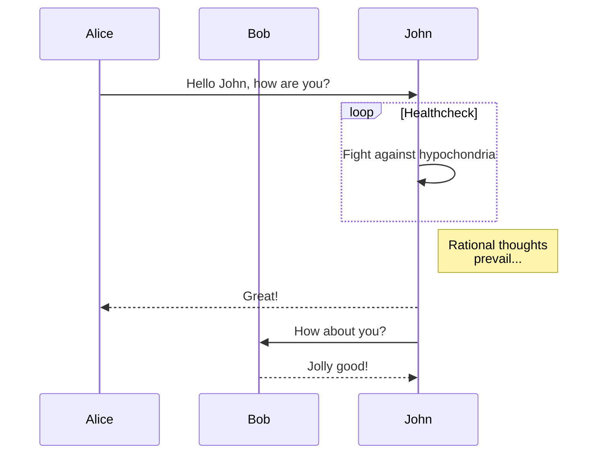
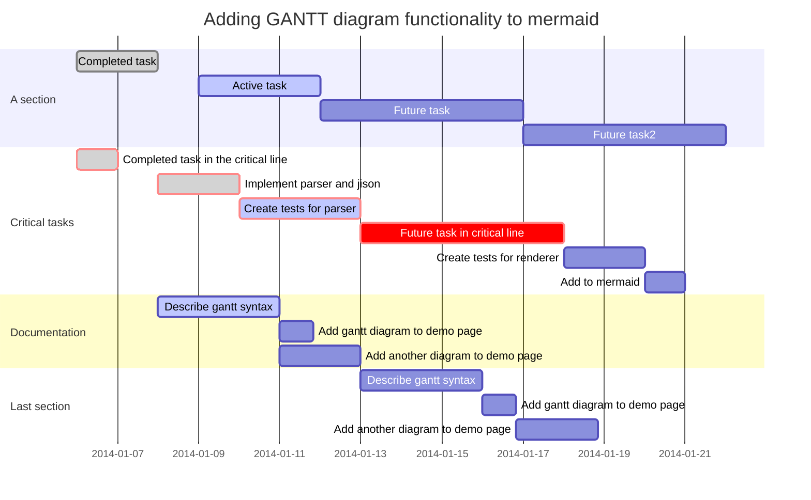

# 图表公式

## 1.[chart](https://plugins.gitbook.com/plugin/chart)
使用 C3.js 图表
### 更多例子见：[官网](https://www.highcharts.com/demo)
如下：
**1.柱图**
```

{
    "chart": {
        "type": "bar"
    },
    "title": {
        "text": "Fruit Consumption"
    },
    "xAxis": {
        "categories": ["Apples", "Bananas", "Oranges"]
    },
    "yAxis": {
        "title": {
            "text": "Fruit eaten"
        }
    },
    "series": [{
        "name": "Jane",
        "data": [1, 0, 4]
    }, {
        "name": "John",
        "data": [5, 7, 3]
    }]
}

```

{
    "chart": {
        "type": "bar"
    },
    "title": {
        "text": "Fruit Consumption"
    },
    "xAxis": {
        "categories": ["Apples", "Bananas", "Oranges"]
    },
    "yAxis": {
        "title": {
            "text": "Fruit eaten"
        }
    },
    "series": [{
        "name": "Jane",
        "data": [1, 0, 4]
    }, {
        "name": "John",
        "data": [5, 7, 3]
    }]
}


---
**2.饼图**
```
{
    "chart": {
        "plotBackgroundColor": null,
        "plotBorderWidth": null,
        "plotShadow": false,
        "type": "pie"
    },
    "title": {
        "text": "Browser market shares January, 2015 to May, 2015"
    },
    "tooltip": {
        "pointFormat": "{series.name}: <b>{point.percentage:.1f}%</b>"
    },
    "plotOptions": {
        "pie": {
            "allowPointSelect": true,
            "cursor": "pointer",
            "dataLabels": {
                "enabled": true,
                "format": "<b>{point.name}</b>: {point.percentage:.1f} %",
                "style": {
                    "color":  "black"
                }
            }
        }
    },
    "series": [{
        "name": "Brands",
        "colorByPoint": true,
        "data": [{
            "name": "IE",
            "y": 56.33
        }, {
            "name": "Chrome",
            "y": 24.03,
            "sliced": true,
            "selected": true
        }, {
            "name": "Firefox",
            "y": 10.38
        }, {
            "name": "Safari",
            "y": 4.77
        }, {
            "name": "Opera",
            "y": 0.91
        }, {
            "name": "Other",
            "y": 0.2
        }]
    }]
}
```

 {
    "chart": {
        "plotBackgroundColor": null,
        "plotBorderWidth": null,
        "plotShadow": false,
        "type": "pie"
    },
    "title": {
        "text": "Browser market shares January, 2015 to May, 2015"
    },
    "tooltip": {
        "pointFormat": "{series.name}: <b>{point.percentage:.1f}%</b>"
    },
    "plotOptions": {
        "pie": {
            "allowPointSelect": true,
            "cursor": "pointer",
            "dataLabels": {
                "enabled": true,
                "format": "<b>{point.name}</b>: {point.percentage:.1f} %",
                "style": {
                    "color":  "black"
                }
            }
        }
    },
    "series": [{
        "name": "Brands",
        "colorByPoint": true,
        "data": [{
            "name": "IE",
            "y": 56.33
        }, {
            "name": "Chrome",
            "y": 24.03,
            "sliced": true,
            "selected": true
        }, {
            "name": "Firefox",
            "y": 10.38
        }, {
            "name": "Safari",
            "y": 4.77
        }, {
            "name": "Opera",
            "y": 0.91
        }, {
            "name": "Other",
            "y": 0.2
        }]
    }]
}




##3.[latex-codecogs](https://plugins.gitbook.com/plugin/latex-codecogs)
使用数学方程式。
[latex规则使用说明](https://en.wikibooks.org/wiki/LaTeX/Mathematics)

[中文使用说明](http://www.mohu.org/info/lshort-cn.pdf)

```
Inline math: $$\int_{-\infty}^\infty g(x) dx$$
Block math:

$$
\int_{-\infty}^\infty g(x) dx
$$
```
Inline math: $$\int_{-\infty}^\infty g(x) dx$$

Block math:

$$
\int_{-\infty}^\infty g(x) dx
$$

---

```
$$
A_{m,n} = 
 \begin{pmatrix}
  a_{1,1} & a_{1,2} & \cdots & a_{1,n} \\
  a_{2,1} & a_{2,2} & \cdots & a_{2,n} \\
  \vdots  & \vdots  & \ddots & \vdots  \\
  a_{m,1} & a_{m,2} & \cdots & a_{m,n} 
 \end{pmatrix}
$$
```
$$
A_{m,n} = 
 \begin{pmatrix}
  a_{1,1} & a_{1,2} & \cdots & a_{1,n} \\
  a_{2,1} & a_{2,2} & \cdots & a_{2,n} \\
  \vdots  & \vdots  & \ddots & \vdots  \\
  a_{m,1} & a_{m,2} & \cdots & a_{m,n} 
 \end{pmatrix}
$$


##4.[mermaid-gb3](https://plugins.gitbook.com/plugin/mermaid-gb3)
最好的流程图，甘特图，类图等图形制作插件
>这个插件会与prism冲突，解决方案把这个插件放在prism插件之前就可以了
###[官方文档](https://mermaidjs.github.io/flowchart.html)
安装
```bash
$ npm install gitbook-plugin-mermaid-gb3
```

例子：

###Flowchart
```

graph TD;
  A-->B;
  A-->C;
  B-->D;
  C-->D;

```


###Sequence diagram

```
sequenceDiagram
    participant Alice
    participant Bob
    Alice->>John: Hello John, how are you?
    loop Healthcheck
        John->>John: Fight against hypochondria
    end
    Note right of John: Rational thoughts <br/>prevail...
    John-->>Alice: Great!
    John->>Bob: How about you?
    Bob-->>John: Jolly good!
```



###Gantt diagram
```
gantt
    dateFormat  YYYY-MM-DD
    title Adding GANTT diagram functionality to mermaid

    section A section
    Completed task            :done,    des1, 2014-01-06,2014-01-08
    Active task               :active,  des2, 2014-01-09, 3d
    Future task               :         des3, after des2, 5d
    Future task2               :         des4, after des3, 5d

    section Critical tasks
    Completed task in the critical line :crit, done, 2014-01-06,24h
    Implement parser and jison          :crit, done, after des1, 2d
    Create tests for parser             :crit, active, 3d
    Future task in critical line        :crit, 5d
    Create tests for renderer           :2d
    Add to mermaid                      :1d

    section Documentation
    Describe gantt syntax               :active, a1, after des1, 3d
    Add gantt diagram to demo page      :after a1  , 20h
    Add another diagram to demo page    :doc1, after a1  , 48h

    section Last section
    Describe gantt syntax               :after doc1, 3d
    Add gantt diagram to demo page      : 20h
    Add another diagram to demo page    : 48h
```




