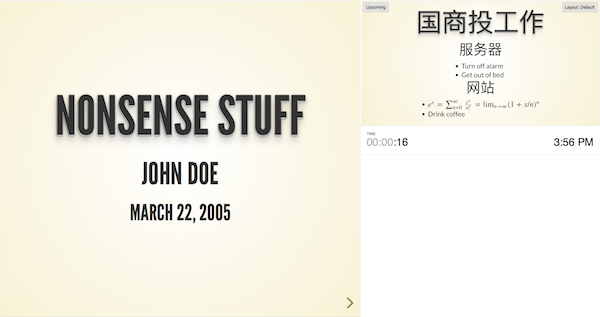

# 其他

## pandoc 生成中文pdf

中英文文档转换

在编写时，由于我们主体还是中文，那么若文档中存在中文字符，那么转换就会出问题。为了使的其支持中文，我们需要使用xelatex编译器（有关xelatex，还请大家自行搜索），下面直接放干货，可以一步操作到位的命令如下。

```
pandoc -N -s --toc --smart --latex-engine=xelatex -V CJKmainfont='黑体' -V mainfont='Times New Roman' -V geometry:margin=1in input.md -o output.pdf
大家可以自行编辑一些.md文档然后使用着条命令进行转换尝试。另外，Markdone转PDF的操作，也可以几个.md文件整合成一个PDF文件，其命令如下。
```

```
pandoc -N -s --toc --smart --latex-engine=xelatex -V CJKmainfont='黑体' -V mainfont='Times New Roman' -V geometry:margin=1in in1.md in2.md ... -o output.pdf
```
### 生成应用论文的命令
到百度学术 找个论文

该文献的Bibtex信息就是这样的一段文本。我们将其拷贝下来，存储到.bib文件里。

依此类推，我们再下载其他两份文献的Bibtex信息。

```
@article{吴信东2016从大数据到大知识,
title={从大数据到大知识:HACE+BigKE},
author={吴信东 and 何进 and 陆汝钤 and 郑南宁},
journal={自动化学报},
volume={42},
number={7},
pages={965-982},
year={2016},
}
```
还有一个"chinese-gb7714-2005-numeric.csl"样式文件。[在这里可以找到](https://github.com/citation-style-language/styles/blob/master/chinese-gb7714-2005-numeric.csl)

```
pandoc --latex-engine=xelatex --filter pandoc-citeproc --bibliography=myref.bib --csl=chinese-gb7714-2005-numeric.csl a.md -o a.docx
```

## pandoc 生成幻灯片
pandoc将markdown的一级标题视为幻灯片组，将二级标题视为幻灯片标题，二级标题下的内容放在一张幻灯片里。 不过，如果某个一级标题下没有二级标题，那么pandoc将把一级标题视为幻灯片标题，将这个一级标题下的内容放在一张幻灯片里， 二级标题显示为子框。

在任何时候，用‘---------’都可以产生一张新幻灯片。

pandoc对markdown有个扩展，在前面加上三行以%开头的内容，分别是标题、作者和日期。

例子如下

```
% Title
% auther
% date

# This is a group

## This is title 1

  This is first slide

  - item 1
  - item 2

## This is tile 2

  This is second slide

-------------

  This is third slide
```


使用xelatex引擎
在模板文件中正确配置
首先导出pandoc的beamer默认配置
```
pandoc -D beamer > beamer-template.tex
```
设置页面比例
在模板文件的documentclass中加入参数aspectratio=169，即
```
\documentclass[..., aspectratio=169]{$documentclass$}
```

设置背景图片
笔者在工作中，需要使用公司的ppt模板，因此需要设置幻灯片的背景。最终采用的解决方法是这样的：

在模板文件中加入命令
```
\usebackgroundtemplate{\includegraphics[width=\paperwidth, height=\paperheight]{background.png}}
```

如果要对标题页单独设置背景，笔者用的是[这篇](https://tex.stackexchange.com/questions/51457/can-i-specify-title-page-customization-in-a-template-instead-of-my-document)文章里的方法:

```
\RequirePackage{tikz}
\addtobeamertemplate{title page}{%
    \begin{tikzpicture}[remember picture,overlay]
        \node [xshift=0cm,yshift=0cm] at (current page.center)
            {\includegraphics[width=\paperwidth, height=\paperheight]{background_title.png}};
    \end{tikzpicture}%
}{}
```
设置字体颜色

```
\definecolor{beamer@font}{RGB}{58,80,99}
\setbeamercolor{titlelike}{use=structure,fg=beamer@font}
\setbeamercolor{title page}{fg=beamer@font}
\setbeamercolor{block body}{fg=beamer@font}
\setbeamercolor{block title}{fg=beamer@font}
\setbeamercolor{block title alerted}{fg=beamer@font}
\setbeamercolor{block title example}{fg=beamer@font}
\setbeamercolor{block body alerted}{fg=beamer@font}
\setbeamercolor{block body example}{fg=beamer@font}
```
## pandoc 生成html幻灯片
分级标题、列表、插入图片……等标准的Markdown语法均被支持，和平常用Markdown记笔记写博客无异。

为了让Pandoc对不包含任何元信息的Markdown文本进行处理生成幻灯片，在文本开头需要包含三行以%打头的元信息：标题、作者和日期。

为了生成合适的用于演示的HTML文档，需要记住的另一点是：在默认情况下每个二级标题是一张独立的幻灯片。这样在写作的时候，只需注意把每个二级标题下的内容控制在适当的长度。

使用reveal.js生成幻灯片
```
$ git clone https://github.com/hakimel/reveal.js
```

除了默认的外观主题以外，reveal.js还提供了多个主题可供选择，
default：（默认）深灰色背景，白色文字
beige：米色背景，深色文字
sky：天蓝色背景，白色细文字
night：黑色背景，白色粗文字
serif：浅色背景，灰色衬线文字
simple：白色背景，黑色文字
solarized：奶油色背景，深青色文字

可以使用--slide-level选项覆盖默认的Slide level
--slide-level 1 则#为一页，2：则#，##为一页

>---可分页

可以直接插入TeX公式：
```
$e^x = \sum_{n=0}^\infty \frac{x^n}{n!} = \lim_{n\rightarrow\infty} (1+x/n)^n$
```
控制TeX公式渲染方式的选项有--mathml，--webtex，--mathjax和--latexmathml。（Chrome和Firefox均支持MathML）

>一般用--mathjax

代码高亮风格
控制代码高亮风格的选项有：
--highlight-style pygments
--highlight-style kate
--highlight-style monochrome
--highlight-style espresso
--highlight-style haddock
--highlight-style tango
--highlight-style zenburn

### 提示板
在Markdown中插入标签<div class="notes">的小抄：

```
<div class="notes">
This is my note.

- It can contain markdown
- like this list

</div>
```
使用键盘s键打开提示板。当然，这个提示板是用来给演讲者自己看的，是不用mirror到外接投影仪的。



附送完整命令：
```
pandoc testslide.md -o slides.html --mathjax -t revealjs -s -V theme=beige --slide-level 2
```
markdown
```
% 国商投总结
% derek fan
% March 22, 2017

# 工作总结

<div class="notes">
This is my note.

- It can contain markdown
- like this list

</div>

## 服务器

- Turn off alarm
- Get out of bed

## 网站

- $e^x = \sum_{n=0}^\infty \frac{x^n}{n!} = \lim_{n\rightarrow\infty} (1+x/n)^n$
- Drink coffee

# PMBA工作

## 推广

- Eat spaghetti
- Drink wine

------------------


## 阿萨德

- 完成XXXXX
- 完成XXX


```
